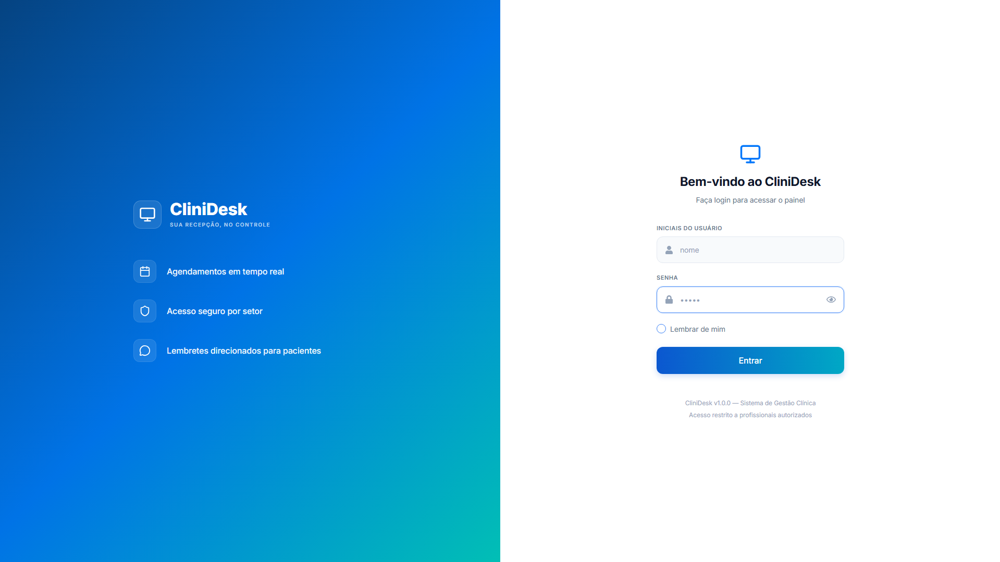

# 🏥 CliniDesk

> Sistema completo e dinâmico para recepção, gerenciamento, confirmação e controle de consultas clínicas em tempo real.

O **CliniDesk** é uma solução moderna desenvolvida para centralizar e otimizar o fluxo de agendamentos em clínicas e ambientes de saúde multi-setoriais. O sistema oferece uma interface altamente intuitiva (*scannable*) que simplifica a jornada de secretários, atendentes e gestores — desde o primeiro cadastro do paciente até a confirmação de presença na recepção e notificações diretas de retorno.

---

## 📸 Demonstração do Sistema

<p align="center">
  
  <br>
  <i>* Insira o print do seu Dashboard na pasta <code>src/assets/dashboard-preview.png</code> para atualizar esta imagem *</i>
</p>

---

## 📜 Contexto e Visão Geral

Gerenciar múltiplas especialidades, horários fragmentados e faltas de pacientes é um desafio crítico em ambientes de saúde. O CliniDesk foi projetado para atuar como o coração da recepção de uma clínica, unificando os dados e automatizando tarefas manuais repetitivas (como avisos de consultas e emissão de lembretes). 

O software resolve dobras de agendamentos, monitora visualmente atrasos por meio de cronômetros lógicos internos e mitiga problemas clássicos de sincronização e perda de fusos horários internacionais comuns ao armazenar dados no MongoDB.

---

## 🚀 Funcionalidades Principais

* **📅 Agendamento Setorial Customizado:** Cadastro completo de pacientes vinculando dados vitais (como telefones de contato próprios e de responsáveis), alocando data e hora específicas dependendo do setor ou clínica de destino selecionada.
* **💬 Integração e Avisos via WhatsApp:** Módulo ágil para o envio de mensagens de texto formatadas com as informações do agendamento direto para o número do paciente ou do seu responsável legal com apenas um clique.
* **🖨️ Impressão de Comprovantes:** Geração instantânea e otimizada para impressão física (impressoras térmicas ou jato de tinta) ou salvamento em PDF do bilhete de consulta para entrega imediata ao paciente.
* **✅ Confirmação de Presença no Sistema:** Sistema de check-in integrado que muda o status do agendamento para confirmar que o paciente já está presente na clínica, facilitando o gerenciamento do fluxo na sala de espera.
* **📆 Calendário em Padrão Nacional (pt-BR):** Utilização de componentes customizados que forçam a exibição e seleção de datas no padrão brasileiro (`DD/MM/YYYY`), independentemente do idioma ou localização do navegador do usuário.
* **🔍 Filtros Reativos Inteligentes:** Atualização instantânea dos dados na tela ao filtrar agendamentos simultaneamente por data (através de mini-calendário dinâmico) ou por clínicas/setores cadastrados.
* **⏰ Alertas Dinâmicos de Horário (Smart Color-Coding):** A tabela calcula em tempo real o tempo restante para cada consulta com base no relógio local do sistema, colorindo as tags de horários de forma inteligente:
  * <kbd>🟢 Verde (Normal)</kbd>: Consulta dentro do prazo de segurança.
  * <kbd>🟡 Amarelo (Próximo)</kbd>: Atendimento programado para acontecer dentro da próxima hora.
  * <kbd>🔴 Vermelho (Atrasado)</kbd>: O horário previsto da consulta já passou e o paciente não realizou o check-in.
* **💾 Sincronização e Persistência Protegida:** Frontend programado para higienizar dados em tempo de execução, garantindo que os agendamentos salvos persistam permanentemente e sejam carregados sem erros mesmo se a página for recarregada.

---

## 🛠️ Tecnologias Utilizadas

| Camada | Tecnologia | Função Principal |
| :--- | :--- | :--- |
| **Frontend Core** | React.js (v18+) | Arquitetura SPA baseada em componentes reativos |
| **Build Tool** | Vite | Compilação ultrarrápida e Hot Module Replacement (HMR) |
| **Estilização** | Custom CSS / Tailwind | Interface moderna, responsiva, fluida e com alto contraste |
| **Gerenciamento de Datas**| `date-fns` | Cálculos dinâmicos de minutos (`differenceInMinutes`) e formatação |
| **Componentes Visuais** | `react-datepicker` | Seletor de datas nativo customizado em português (`pt-BR`) |
| **Ícones** | `lucide-react` | Biblioteca de vetores leves e modernos para UI |
| **Comunicação API** | Axios | Requisições HTTP assíncronas assinaladas ao backend |
| **Banco de Dados** | MongoDB | Banco NoSQL flexível para armazenamento estruturado de consultas |

---

## ⚙️ Arquitetura de Datas (Solução de Engenharia)

Um dos destaques técnicos deste projeto reside no tratamento de fuso horário. Por padrão, o MongoDB armazena dados no formato de string ISO com timezone (`2026-05-28T00:00:00.000Z`). Para evitar conflitos visuais e inconsistências onde consultas sumiam do calendário devido à conversão do fuso do banco, o projeto implementou um pipeline de tratamento de dados de duas vias:

1. **Envio (Inserção):** O formulário intercepta o objeto `Date` gerado no frontend e o transforma na string linear padronizada `yyyy-MM-dd` antes de submeter ao servidor.
2. **Recebimento (Renderização & Filtros):** O Dashboard quebra a string ISO trazida pelo backend, garantindo correspondência cirúrgica milissegundo a milissegundo:

```javascript
// Higienização que remove resíduos de fuso horário internacional (T00:00...)
const dataConsultaLimpa = consulta.data.includes('T') 
  ? consulta.data.split('T')[0] 
  : consulta.data;


---

## 🔧 Como Executar o Projeto
Pré-requisitos
Certifique-se de ter instalado em seu ambiente:

Node.js (Recomendado: v18 ou superior)

Gerenciador de pacotes npm ou yarn

API/Servidor backend ativo (rodando localmente na porta 5000)

Passo a Passo
1. Clone este repositório:

Bash
git clone [https://github.com/seu-usuario/clinidesk.git](https://github.com/seu-usuario/clinidesk.git)

2. Entre no diretório do projeto:
Bash
cd D.S-Project

3. Instale todas as dependências do projeto:
Bash
npm install

4. Inicie o ambiente de desenvolvimento local:
Bash
cd Front
npm run dev

cd backend
Node src/server.js

